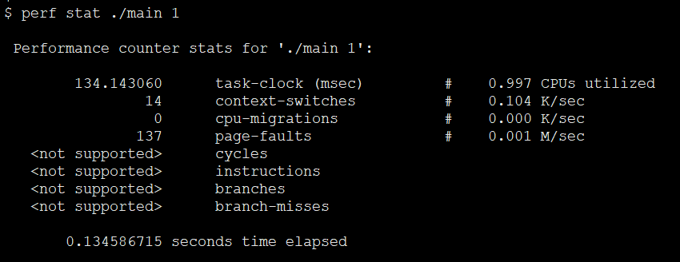
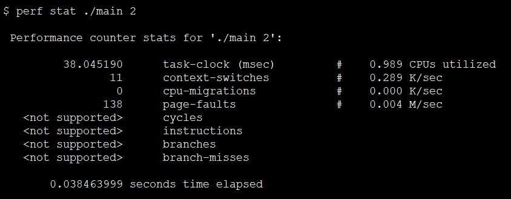
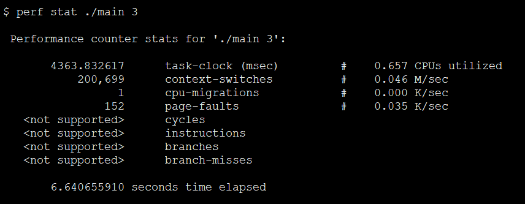

# 002
libuv

## Build Instructions
see [build-instructions](https://github.com/libuv/libuv#build-instructions)

## performance
difference between   and 

## documentation
[API documentation](http://docs.libuv.org/en/v1.x/api.html)
