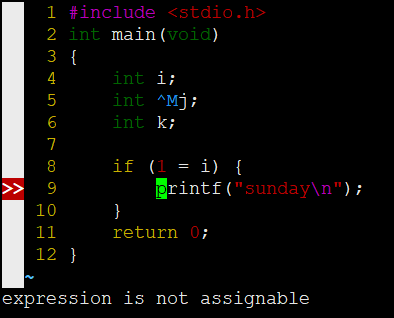
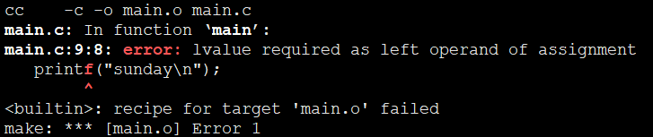

# 012
Traceback line numbers do not match source line numbers

## Description
When I compile a c source file with gcc, it hint me that there is an error in line 9, but it was line 8 in fact, this situation is show below.  

so I search in the Net, and find [this](https://community.intel.com/t5/Intel-Fortran-Compiler/Traceback-line-numbers-do-not-match-source-line-numbers/td-p/1044414), in short, It was the line terminators.

## Notes

## reference
1. [Traceback line numbers do not match source line numbers](https://community.intel.com/t5/Intel-Fortran-Compiler/Traceback-line-numbers-do-not-match-source-line-numbers/td-p/1044414)
2. [vim 输入特殊字符](https://www.cnblogs.com/sciapex/p/9826287.html)
3. [vim与回车换行](http://blog.sina.com.cn/s/blog_4c76784c0100uaf9.html)
