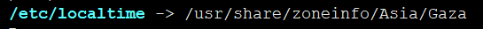

需要先明确一些概念

**Epoch**：现代的时间体系是基于一个时间纪元开始的，它表示1970-01-01 00:00:00 +0000 (UTC)，也就是0时区的1970年1月1日0时

**calendar time**：日历时间，用秒表示，也就是从**Epoch**到现在经历的秒数，时间是不停流逝的，不管你所处的地方是哪个时区，时间怎么表示，这个日历时间都是一致的。


日历时间是不直观的，时间转换函数说明

| 函数名    | 作用                                                         |      |
| --------- | ------------------------------------------------------------ | ---- |
| gmtime    | 转化日历时间（calendar time）到UTC分解时间（broken-down time） |      |
| localtime | 转化日历时间（calendar time）到本地时区分解时间（broken-down time） |      |
| mktime    | 转化本地时区分解时间（broken-down time）到日历时间（calendar time） |      |


已被弃用的函数

| 函数名         | 引入标准     | 弃用标准     | 代替函数        |
| -------------- | ------------ | ------------ | --------------- |
| asctime()      | C89 and C99  | POSIX.1-2008 | strftime()      |
| asctime_r()    | C89 and C99  | POSIX.1-2008 | strftime()      |
| ctime()        | C89 and C99  | POSIX.1-2008 | strftime()      |
| ctime_r()      | C89 and C99  | POSIX.1-2008 | strftime()      |
| gettimeofday() | POSIX.1-2001 | POSIX.1-2008 | clock_gettime() |
|                |              |              |                 |
|                |              |              |                 |
|                |              |              |                 |
|                |              |              |                 |


tzset函数声明如下

```c
#include <time.h>

void tzset (void);

extern char *tzname[2];
extern long timezone;
extern int daylight;
```

tzset首先通过环境变量**TZ**初始化*tzname*变量

如果环境变量存在但是内容为空，或者其格式不能识别，则使用UTC时间。

如果环境变量不存在，则会使用系统时区，系统时区使用一个时区文件链接到`/etc/localtime`，如下



时区文件格式详见参考2


## reference

1. man 7 time
2. man 5 tzfile
3. man 3 tzset